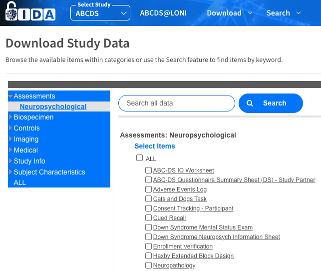

# Frequently Asked Questions

Last Revised: October 10, 2024  
VERSION 1.0

## Overview

### Database Structure

::: {.faq-item}
::: {.faq-q}
What is the overall structure of the database?
:::
::: {.faq-a}
The research design calls for evaluating each subject at intervals of
approximately 16 months. The data available on LONI are organized into separate
tables, each representing and named for a particular data domain, e.g.
Neuropsychiatric_Inventory, Registration, Premorbid Functioning. For data
collected at each evaluation, tables are organized in a
one-record-per-evaluation format, sorted by ID (subject_label) and consecutive
evaluation number (event_sequence). The latency in days between the baseline
evaluation and each subsequent evaluation, and the age of the subject at each
evaluation are documented in the table Age_at_Event_and Latency. Data types
collected only once for each subject have one record per subject_label. Tables
contain data collected from control subjects have the suffix ‘_Control’ in the
table name. All other data tables contain data collected from subjects with Down
Syndrome.
:::
:::

--- 

### Data Tables on LONI

::: {.faq-item}
::: {.faq-q}
How are data tables organized on the LONI website?
:::
::: {.faq-a}
As shown in the table below, data are organized by domain. After selecting a
domain, all tables in that category are shown; individual tables or all tables
may be selected and downloaded.

:::
:::

  

--- 

### Documentation

::: {.faq-item}
::: {.faq-q}
Is there documentation for each domain, in addition to information provided in this FAQ document?
:::
::: {.faq-a}
Yes, a document with information specific to each domain has provided by project
leaders responsible for the collection and processing of each data type. These
documents appear in each of the domain-specific tabs on the LONI website.
:::
:::

---

### Data Sources

::: {.faq-item}
::: {.faq-q}
What is the source of available data?
:::
::: {.faq-a}
The data available on LONI come from three different projects: ADDS and NiAD,
funded through a U01 mechanism, and the ongoing ABC-DS U19 project. The
available data have been harmonized across all three projects. ADDS and NiAD
collected non-overlapping samples of Down Syndrome cases. The current U19
project includes subjects continuing from the U01 projects as well as newly
recruited subjects, i.e. individuals not previously seen in ADDS or NiAD. ADDS
did not collect data on controls, while NiAD and the current U19 project
recruited sibling controls of Down Syndrome subjects.
:::
:::

---

## Data Dictionary

### Dictionary and Codebook

::: {.faq-item}
::: {.faq-q}
Is a data dictionary available?
:::
::: {.faq-a}
Yes, a data dictionary containing the names and descriptions is available. For
categorical variables, labels of each numeric value for each variable are
provided in a separate codebook.
:::
:::

---

### Free Text Columns

::: {.faq-item}
::: {.faq-q}
In the data dictionary, what are the field_types “D” “N” and “T”?
:::
::: {.faq-a}
There are free text columns in the EDC, but they are omitted from the external
investigator-facing data freezes.
:::
:::

---

### Event Sequence

::: {.faq-item}
::: {.faq-q}
What does ‘event sequence’ refer to?
:::
::: {.faq-a}
Event_sequence is just that, an indication of the sequential number of times the
subject has had across the ABC-DS study.
:::
:::

---

### Seizure Variable

::: {.faq-item}
::: {.faq-q}
Where is the ‘seizure’ variable in the harmonized dataset?
:::
::: {.faq-a}
We no longer administer the health questions on the NTG-EDSD form in the U19, so
the seizure variable wouldn’t be in the harmonized data set (U01/U19). However,
there is a variable in the health history form (hh_seizure). This will only tell
us if there has ever been a seizure diagnosis. It does not tell us whether it is
currently an issue. We had to collapse the Recent/Active and Remote/Inactive
variables into just yes/no in the harmonized data set.
:::
:::

---

## Cognitive and Caregiver Measures

### Cognitive Inventory

::: {.faq-item}
::: {.faq-q}
Is there an inventory of which neuro/psych/cognitive tests are available for
ABC-DS participants?
:::
::: {.faq-a}
Yes, you will find these in the Clinical Core Methods Document posted on LONI or
available [here](clinical-core.html)
:::
:::

---

### Vineland Data

::: {.faq-item}
::: {.faq-q}
There is only one assessment per subject and the `event_sequence` takes
different values depending on the subject. Does this imply this assessment was
only collected once per subject and possibly at different visits (not
necessarily at baseline)?
:::
::: {.faq-a}
Each participant only has one Vineland record. It might have been done in a
visit that was not the Baseline visit.
:::
:::

---

### ABC-DS IQ Data

::: {.faq-item}
::: {.faq-q}
The variables MTAGE1, MTAGE2, MTAGE3 in the ABC-DS IQ Worksheet data do not seem
to be included in the documentation provided. Q: Can you please point to any
data specifications where these variables are described.
:::
::: {.faq-a}
Not many participants had alternate additional sources. “MTAGE” stands for
Mental Age for source 1, 2, and 3.
:::
:::

---

### Cognitive Distributions

::: {.faq-item}
::: {.faq-q}
Are all the distributions normal for the cognitive tests?
:::
::: {.faq-a}
For all the cognitive measures, before performing any modelling, please check
the variables distributions. The vast majority of them have a skewed
distributions and are zero inflated, which requires either some type of
transformation or proper modelling.
:::
:::

---

## Adverse Events

::: {.faq-item}
::: {.faq-q}
Do you know if we can find what adverse events were recorded?
:::
::: {.faq-a}
The only AE data in the harmonized dataset is cause of death if occurred.
:::
:::

---

## NeuroImaging

### MRI Scans

::: {.faq-item}
::: {.faq-q}
Is it possible to see MRI reports or a list with the # and type of abnormal
findings, e.g., areas of siderosis or micro-/macro-hemorrhages?
:::
::: {.faq-a}
This data is not available in the harmonized dataset.
:::
:::

---

### Image Processing

::: {.faq-item}
::: {.faq-q}
I was not able to view or add post-processed images to my data collection and
also wondered what kind of pre-processing and post-processing was done. 
:::
::: {.faq-a}
Our Neuroimaging Core leads are <a href="mailto:bchristian@wisc.edu"/>Brad
Christian</a> and <a href="mailto:amb2139@cumc.columbia.edu"/>Adam Brickman</a>.
You can contact them for more information. In the future there will be a Methods
document available on LONI for Neuroimaging. 
:::
:::

---

### Structural MRI Scans

::: {.faq-item}
::: {.faq-q}
Can you provide any information on decisions about which T1 sequences were used
at which sites / visits. The dataset contains several variations of MPRAGE and
SPGR sequences, and we want to ensure that our analyses are not biased in any
way by the different types of sequences.
:::
::: {.faq-a}
The specific acquisition parameters should be contained within the header
information for each scan. For the U19 data, T1-weighted scans were collected
using the ADNI 4 protocol, set up by the Mayo group for the different scanners
(I think most are on Siemens, maybe one or two sites are on GE). Prior to the
U19, there were two separate consortia (we sometimes call this the “U01 data”),
including NiAD & ADDS. The T1-weighted scan parameters were harmonized within
consortium but not necessarily across consortia.
:::
:::

---

### Available Imaging Results

::: {.faq-item}
::: {.faq-q}
What analysis results data is available on LONI?
:::
::: {.faq-a}
The only analysis results currently at LONI are those for centiloid for the
former NiAD/ADDS study.
:::
:::

---

### Centiloid 

::: {.faq-item}
::: {.faq-q}
How does the centiloid file interact with the `event_sequence`?
:::
::: {.faq-a}
Currently it does not include the `event_sequence` and it is all “U01” data. In
the future the `event_sequence` will be added.
:::
:::

---

## Clinically Significant Findings

::: {.faq-item}
::: {.faq-q}
Does ABCDS-U19 ClinSigFindings 2 include all abnormal MRI findings from the U19
cohort?
:::
::: {.faq-a}
Yes, it contains all the findings that were reported and entered into the EDC by
the time of the data freeze Health History and Concurrent Medications.
:::
:::

---

## Health History and Medications

::: {.faq-item}
::: {.faq-q}
Is there any information on concurrent medications and prior medical history in
Freeze 4 data?
:::
::: {.faq-a}
Yes, these tables are available on LONI.
:::
:::

---

## Lookup Table

::: {.faq-item}
::: {.faq-q}
Is there a look up table for all these IDs?
:::
::: {.faq-a}
Yes, the ‘crosswalk’ is in the internal analytic file, available to ABC-DS internal investigators
:::
:::

---

::: {.faq-item}
::: {.faq-q}
Is there an indicator of whether or not a participant is on TRC-DS since
treatments can alter biomarker results?
:::
::: {.faq-a}
Yes, we know if they were/are co-enrolled, but that doesn’t mean they are in a
clinical trial (yet); the eCRF/data for clinical trial participation is in
progress as of 9/2024.
:::
:::

---

## Harmonization

::: {.faq-item}
::: {.faq-q}
Is imaging and IQ data harmonized between ADDS and NiAD?
:::
::: {.faq-a}
For imaging, it depends on the measure; amyloid PET is harmonized using
centiloids; MRI and Tau PET are not harmonized. If amyloid PET is used for
analyses then centiloids should be used since centiloids are a standardized
measure of amyloid deposition. Site should still be included in all analysis as
a covariate regardless of harmonized data or not. All derived MRI measures
(cortical thickness and volumetrics) as well as Tau PET are not harmonized and
at least Combat should be employed for derived imaging measures to derive
harmonized outcomes. For voxel level analysis some standardization can be
employed, such as RAVEL, but it is generally variable. Reach out to Biostats
Core <a href="mailto:dlt30@pitt.edu">Dr. Tudorascu</a> to discuss a
harmonization plan if needed. Some useful references.[@torbati2021multi;
@fortin2016removing; @fortin2018harmonization] For IQ, there is a premorbid
functioning level variable `prefunclevel`.
:::
:::

---

## Clinical Lab and MOMs Data

::: {.faq-item}
::: {.faq-q}
Are clinical chemistry data (e.g., cholesterol) included?
:::
::: {.faq-a}
Yes, this data is a standalone file on LONI
:::
:::

---

::: {.faq-item}
::: {.faq-q}
Are MOMs study data included?
:::
::: {.faq-a}
Not yet, there will be a separate MOMs data file when the supplement ends in
December 2024.
:::
:::

---

## Gap

::: {.faq-item}
::: {.faq-q}
How was the gap between the visit and scanning/assay dealt with?
:::
::: {.faq-a}
There are latency variables between all events
:::
:::

---

## Errors

::: {.faq-item}
::: {.faq-q}
How are the data entry errors or sample switches handled?
:::
::: {.faq-a}
LONI has a procedure
:::
:::

---

::: {.faq-item}
::: {.faq-q}
Is there a website so that data users know whether they are using the updated and correct data?
:::
::: {.faq-a}
In the ABC-DS Project in LONI, the current data freeze is available; track the dates of your datasets; check the Ns;
:::
:::

---

## Latency and Event Sequence

### Event Sequence

::: {.faq-item}
::: {.faq-q}
Can you please confirm the variable `event_sequence == 1` refers to baseline and
`clinical_latency_in_days` can be used to determine the time since
baseline for all visits with `event_sequence` > 1.
:::
::: {.faq-a}
Yes, confirmed.
:::
:::

---

### Latency

::: {.faq-item}
::: {.faq-q}
What are the latency variables?
:::
::: {.faq-a}
`clinical_latency_in_days`; `amy_latency_in_days`; `tau_latency_in_days`;
`fdg_latency_in_days`; `csf_latency_in_days`; all use Cycle 1/baseline as the
reference point.

:::
:::

---

## Biospecimens/Omics

### Biospeciman Dataset

::: {.faq-item}
::: {.faq-q}
How is the event sequence determined in the biospecimen dataset? Can we use
`rundate` to determine the baseline visit? It seems that `rundate` may
not be valid since it does not reflect the time of sample collection. In this
case, how do we then determine baseline, and the relative timing (in days,
months) of subsequent assessments?
:::
::: {.faq-a}
The “Biospecimens” file should not be used, it was deleted in late August 2024,
Use the CSF file.
:::
:::

---

### Proteomics

::: {.faq-item}
::: {.faq-q}
Where is the proteomic file?
:::
::: {.faq-a}
It is not on LONI yet. As of October 2024 we are waiting for the Methods
document before the data can be posted.
:::
:::

